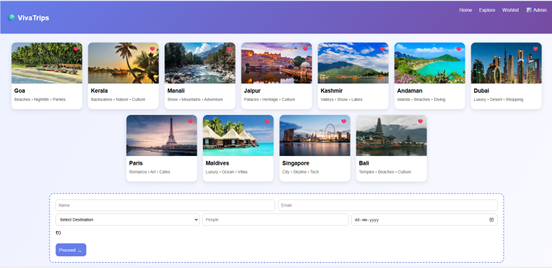
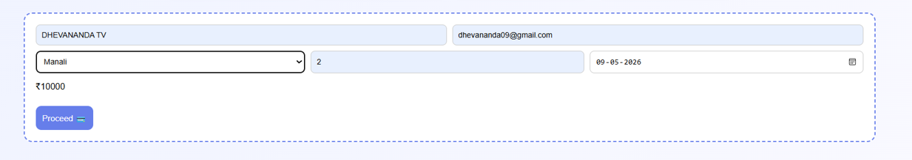
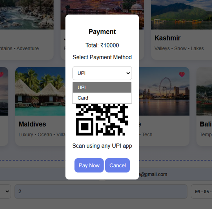
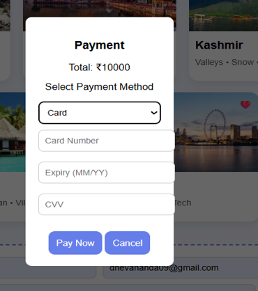
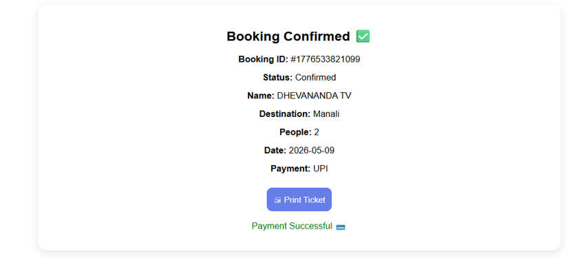
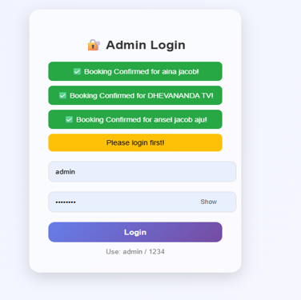
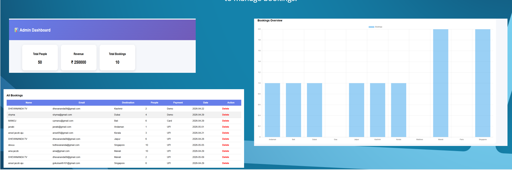

# 🌍 Travel Booking Web Application

A full-stack travel booking web application built using Flask that allows users to explore destinations, make bookings, and enables admins to manage and analyze booking data through a dashboard.

---

## 🚀 Features

* 🌍 Explore popular Indian and international destinations
* 📝 Booking system with user details and travel date
* ✅ Booking confirmation with feedback message
* 🧾 Stores booking data using SQLite database
* 🔐 Admin login with authentication
* 📊 Admin dashboard with booking statistics
* 💰 Revenue calculation based on bookings
* 🗑️ Delete bookings from admin panel
* ❤️ Wishlist page for saving destinations

---

## 🛠️ Tech Stack

* **Backend:** Python (Flask)
* **Database:** SQLite (SQLAlchemy)
* **Frontend:** HTML, CSS, Bootstrap
* **Authentication:** Werkzeug Security

---

## 📂 Project Structure

```
├── app.py
├── travel.db
├── templates/
├── static/
```

---

## 📸 Screenshots

### 🏠 Home Page (Index)



### 📝 Booking Form



### 💳 Payment Mode Selection




### ✅ Booking Confirmation



### 🔐 Admin Login



### 📊 Admin Dashboard



---

## ⚙️ How to Run

1. Clone the repository
2. Install dependencies

   ```bash
   pip install flask flask_sqlalchemy
   ```
3. Run the application

   ```bash
   python app.py
   ```
4. Open in browser

   ```
   http://127.0.0.1:5000
   ```

---

## 🔐 Admin Login

* **Username:** admin
* **Password:** 1234

---

## 💡 Future Improvements

* Online payment integration
* Customer login/signup system
* Email confirmation for bookings
* Cloud deployment (Render / AWS)
* Improved UI/UX design

---

## 👩‍💻 Author

**Dhevananda TV**
